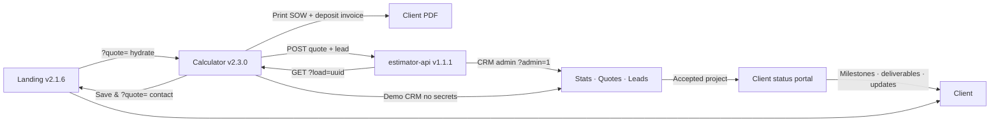

# Hi, I'm He Zhang (PixelLayer) 👋

**React / Frontend developer** building **bilingual, test-backed** product demos — not mockups.  
**React / 前端开发者** — 可演示、可测试的双语 Web 产品，而非静态原型。

📫 **pixellayer7@gmail.com** · **Available for frontend / full-stack roles** (remote OK)

🌐 **Live:** [Landing v2.1.6](https://pixellayer7-jpg.github.io/1/) · [Quote calculator v2.3.0](https://pixellayer7-jpg.github.io/project-estimator/) · [CRM admin](https://pixellayer7-jpg.github.io/project-estimator/?admin=1) · [Client portal](https://pixellayer7-jpg.github.io/project-estimator/?portal=demo)

---

## Architecture (open-source product loop)

| Layer          | Repo                                                                      | Live                                                         | Highlights                                              |
| -------------- | ------------------------------------------------------------------------- | ------------------------------------------------------------ | ------------------------------------------------------- |
| **Marketing**  | [1](https://github.com/pixellayer7-jpg/1)                                 | [Demo](https://pixellayer7-jpg.github.io/1/)                 | Case studies, changelog, portal link, mailto-first      |
| **Calculator** | [project-estimator](https://github.com/pixellayer7-jpg/project-estimator) | [Demo](https://pixellayer7-jpg.github.io/project-estimator/) | SOW / invoice, **CRM demo**, **client portal**, handoff |
| **API**        | [estimator-api](https://github.com/pixellayer7-jpg/estimator-api)         | Docker / Render                                              | Lead status CRM, stats breakdown, local dev compose     |

**Interview walkthrough (5 min):** [Landing](https://pixellayer7-jpg.github.io/1/) → [Calculator](https://pixellayer7-jpg.github.io/project-estimator/) → **Print proposal + deposit invoice** → [CRM admin](https://pixellayer7-jpg.github.io/project-estimator/?admin=1) → [Client status portal](https://pixellayer7-jpg.github.io/project-estimator/?portal=demo). CRM and portal both work without API secrets.

---

## 🛠 Stack

`React 18` · `Vite 5` · `Vitest` · `Testing Library` · `Node 20` · `Fastify` · `GitHub Actions` · `GitHub Pages` · `Docker` · `i18n` · `a11y`

---

## 💼 What I bring

- **End-to-end thinking** — landing → tool → API → CRM admin → deploy docs
- **Engineering quality** — CI, tests, schema validation, security headers
- **Bilingual UX** — EN / 中文 across public demos

---

## 📊 GitHub activity

---

## 🔗 Hub Index

- [PixelLayer Hub Index](./HUB-INDEX.md)
- [Profile setup checklist](./GITHUB_PROFILE_SETUP.md)

---

PixelLayer L.L.C · MIT-licensed portfolio · [All repos](https://github.com/pixellayer7-jpg?tab=repositories)
