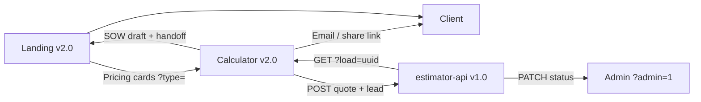

# Hi, I'm He Zhang (PixelLayer) 👋

**React / Frontend developer** building **bilingual, test-backed** product demos — not mockups.  
**React / 前端开发者** — 可演示、可测试的双语 Web 产品，而非静态原型。

📫 **pixellayer7@gmail.com** · **Available for frontend / full-stack roles** (remote OK)

🌐 **Live:** [Landing v2.0](https://pixellayer7-jpg.github.io/1/) · [Quote calculator v2.0](https://pixellayer7-jpg.github.io/project-estimator/)

---

## Architecture (open-source product loop)

| Layer | Repo | Live | Highlights |
|-------|------|------|------------|
| **Marketing** | [1](https://github.com/pixellayer7-jpg/1) | [Demo](https://pixellayer7-jpg.github.io/1/) | Case studies, testimonials, booking CTA, lead API hook |
| **Calculator** | [project-estimator](https://github.com/pixellayer7-jpg/project-estimator) | [Demo](https://pixellayer7-jpg.github.io/project-estimator/) | SOW Markdown export, quote admin panel |
| **API** | [estimator-api](https://github.com/pixellayer7-jpg/estimator-api) | Docker / Render | Leads pipeline, quote CRM status, stats |

**Interview walkthrough (5 min):** [Landing](https://pixellayer7-jpg.github.io/1/) → [Calculator](https://pixellayer7-jpg.github.io/project-estimator/) → pick options → **Download SOW** → handoff to contact → (with API) save, `?load=`, admin status.

---

## 🛠 Stack

`React 18` · `Vite 5` · `Vitest` · `Testing Library` · `Node 20` · `Fastify` · `GitHub Actions` · `GitHub Pages` · `Docker` · `i18n` · `a11y`

---

## 💼 What I bring

- **End-to-end thinking** — landing → tool → API → deploy docs  
- **Engineering quality** — CI, tests, schema validation, security headers  
- **Bilingual UX** — EN / 中文 across public demos  

---

## 📊 GitHub activity

---

PixelLayer L.L.C · MIT-licensed portfolio · [All repos](https://github.com/pixellayer7-jpg?tab=repositories)
